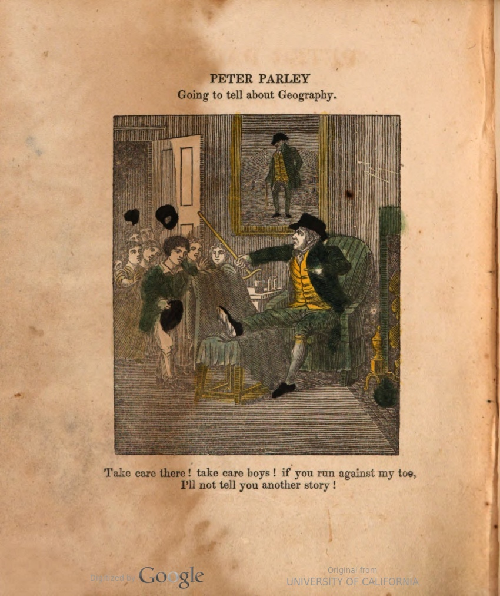

## Introduction

https://orcid.org/0000-0002-6086-0649 (Stephen Krewson)

The "Deriving Basic Illustration Metadata" grant has successfully concluded with the creation of a large and novel dataset. This dataset is publicly available through HTRC (via `rsync`) and Zenodo. It consists of roughly 2.5 million illustrated regions as well as vector representations of each region.

In this sense, there are two extracted features: the crop itself and the vector representation.

```
Total number of volumes: 183,553
Total number of page image files (scans): 1,922,602
Total size of above page image files: 685,371,546,511 bytes (685+ GB)
Total number of crops (generated in step2): 2,584,888
Total size of above crop files: 553,399,284,753 bytes (553+ GB)
Total size of text OCR for above pages: 2,407,897,173 bytes (2.4+ GB)
Page image formats:
   1,901,456 image/jp2
      21,269 image/tiff
Page image labels (from step1):
   1,077,544 inline_image
     845,181 plate_image
```

## Dataset 

Here is what is on Zenodo:

| File | Description |
| ---- | ----------- |
|      |             |
|      |             |
|      |             |

Link: 

2,584,888 numpy vectors. Each 4128 bytes. 15GB

Use of stubbytree vs. pairtree (old).

Deliverable: CSV with vectors attached???

### Code

The code used in the project is zipped up on Zenodo. It is also available (for how long?) on Github:

https://github.com/htrc/ACS-krewson

## Steps

The process involved three steps. Use Boris's attachments to demonstrate vector + classes.

[Illustration from MHL paper]

### 1. Identify illustrated pages

Step 1 is detailed in my [mid-point report](https://wiki.htrc.illinois.edu/display/COM/A+Half-Century+of+Illustrated+Pages%3A+ACS+Lab+Notes). The model is versioned in Zenodo as TITLE. DOI for my publication?

### 2. Extract illustrated regions

Remember to cite Mask-RCNN model. Use MHL content!

### 3. Reduce dimensionality

For search. Parameter tuning, etc. Python function to use. Citation for InceptionV3 paper.

## Case Study

Use 2017 workshop; use the Parley fireside engravings!!!! Fingers crossed they yield good results. ivpy for montage of nearest neighbors. Ooh should I write this as a Jupyter notebook??

**uc1.31822031034416-seq_12** -- will this example find other crutches? other hand colored images?



https://babel.hathitrust.org/cgi/pt?id=uc1.31822031034416&view=1up&seq=12

Compare with walking image: 

https://babel.hathitrust.org/cgi/pt?id=osu.32435078698222&view=1up&seq=8

If these don't turn out well, use balloon stuff. Or maybe animals.

## Discussion

Discussion.

There are several applications for this dataset...

- Reverse image search

Cite Melvers and Smit and some other papers from MHL.

## Acknowledgements

That this project was successfully completed is due to the following individuals. Through a year of many changes, and my own lapses in concentration, they stuck with me and are fully responsible for a really nice result.

- Ryan Dubnicek, for his empathetic,  and calm project management
- Boris Capitanu for his technical abilities and good humor and willingness to 
- Eleanor Dickson Koehl, for perceptive questions about the project's place in the wider world of DH research
- Doug Duhaime for use of his vectorization code and generous advice. As well as for bringing this grant to my attention.

## References