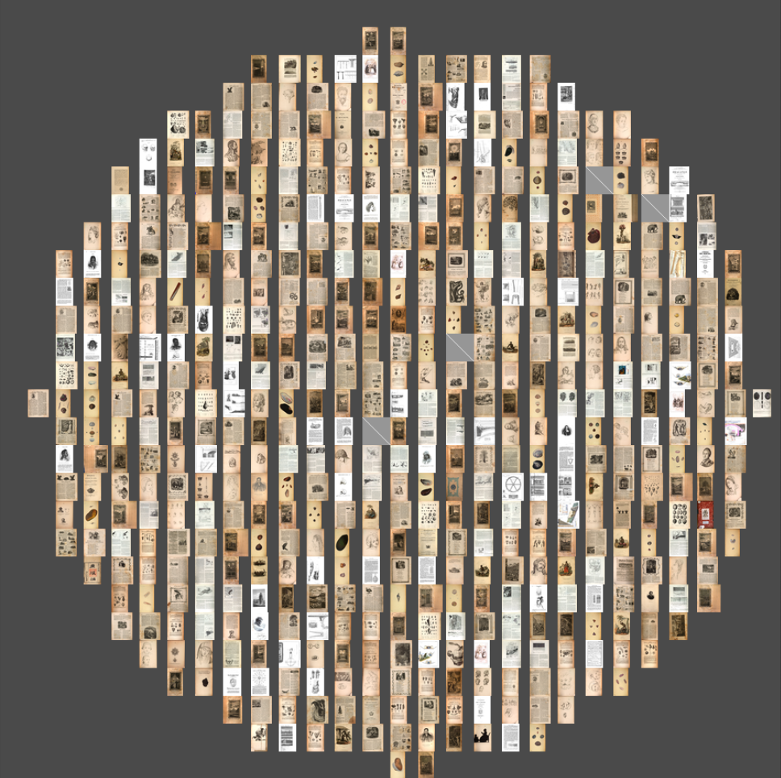

# A Half-Century of Illustrated Pages: An ACS Update

We're now roughly at the mid-point of my [Advanced Collaborative Support project](https://www.hathitrust.org/hathitrust-research-center-awards-five-acs-projects), "Deriving Basic Illustration Metadata." Many thanks to Ryan Dubnicek and Eleanor Dickson-Koehl for coordinating the project and to Boris Capitanu for his always-stellar technical support.

Right now, sitting on a supercomputer named Big Red at the University of Indiana, is a rather remarkable dataset: *every illustrated page from every Google-scanned volume in the HathiTrust Digital Library from 1800-1849*. By the numbers this means **500,000** volumes and **1,900,000** pages. In my Data Capsule in Secure Mode, I can explore this data in JSONL form.

This post sketches our basic data pipeline, highlighting a few decisions that are especially important for large-scale image processing.

The main takeaways from the first phase of "Deriving Basic Illustration Metadata" are:

1. Image processing needs to be done in batch, in parallel
2. Postpone conversion/reorganization as long as possible

Code can be found at:

https://github.com/htrc/ACS-krewson

## Pipeline

Link to BioDiversity Library (and their implementation)

Things worth going into a bit more detail on:

- Pairtree
- Parallelism
- fast.ai
- JP2 conversion

Here's an image, courtesy of Damon Crockett's ivyp:

## Discussion

## Next Steps

- Bounding boxes (test?)
- "Fingerprinting"
- Clustering
- Interpretation

## HTRC Update Post Examples

*from Ryan:*

As requested and only (!) a couple of weeks late, here are links to some example blog posts from a group from our last ACS round:

- https://newreadia.wordpress.com/2018/10/10/extracting-and-organizing-htrc-corpora-tool-and-walkthrough/
  - Presents "Program Era Project" extractor tool that tries to get ISBN and other metadata and puts it into JSON form (from zipped pairtree)
- https://dsps.lib.uiowa.edu/programera/2018/02/09/breaking-down-the-htrc-data-capsule/
  - Basic graphs on (multi)authorship for Iowa Workshop study; basic "data profile" and plan for further text analysis
- https://dsps.lib.uiowa.edu/programera/2017/11/20/collaborating-with-hathitrust/
  - In-depth drive of StyleCard and LitMap (data shown in plot.ly)

You’ll see that the focus of the posts varies, as does the length and the depth to which results are discussed. Whatever makes sense for the progress of your project will almost certainly work for us, but let me know if you have any questions or if you wanted to share a draft in advance, even. Sharing a draft is definitely not required, though.