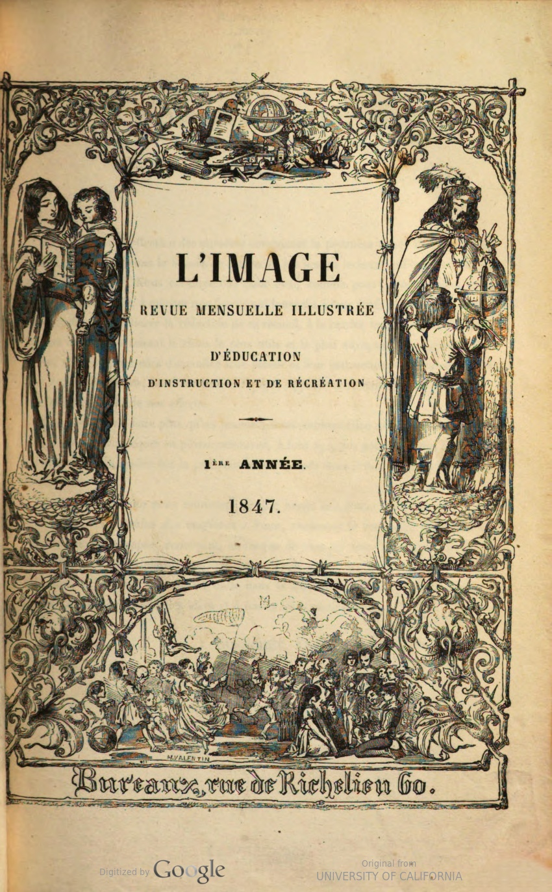
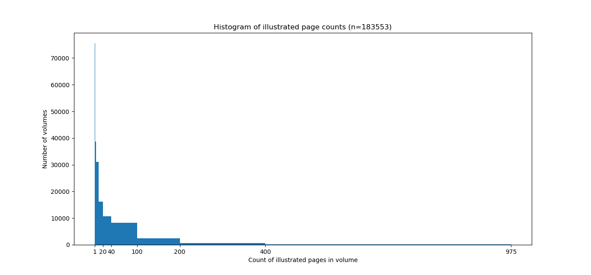

We've reached the mid-point of my [Advanced Collaborative Support project](https://www.hathitrust.org/hathitrust-research-center-awards-five-acs-projects), "Deriving Basic Illustration Metadata." Many thanks to Ryan Dubnicek and Eleanor Dickson Koehl for coordinating the project and to Boris Capitanu for his always-stellar technical support.

Right now, sitting on a supercomputer named Big Red at the University of Indiana, is a rather remarkable dataset: *every illustrated page from every Google-scanned volume in the HathiTrust Digital Library (HT) for the period 1800-1850*. Although the image processing pipeline we are using is by no means new, working at this scale is.

A working hypothesis of historical studies of illustration is that graphic elements in printed objects exhibit technical and stylistic similarity over time, but this development is *uneven*. That is to say, illustrations "change with the times" at different rates. On the one hand, the emergence of new techniques like lithography will exert a competitive pressure on the book market and prompt imagemakers to explore the affordances of the new medium. On the other hand, reuse of woodblocks and other at-hand materials remains appealing. In some cases, a "vintage" style may even be desirable.

Before attempting to characterize this "unevenness" computationally, many smaller steps are necessary. The first step involves putting together a dataset of images that can plausibly represent the breadth of printed illustrations for a period in time. My project's 50-year sample pushes up against the limits of what can be stored on disk for a project, but HTRC's resources make possible what would be otherwise unimaginable for a graduate student. Although choosing a start year at the beginning of a century has no direct relationship to innovations in image production, fifty years is roughly the length of a Kondratiev cycle. At the very least, five decades should generate plenty of real historical signal.

What do I mean by "signal"? At the end of the project, each illustration in the dataset will be encoded as a vector of numbers. This allows for calculating similarities between images. All other things being equal, we would expect similar images to loosely correlate with each other in time. By building "nearest neighbor" maps for certain types of images, we can test whether this is the case and also discover moments of aesthetic anachronism, when older styles reappear.

The following sections discuss our progress, making some detours to discuss problems that future researchers may face when using HathiTrust for *image* rather than text analysis.

## Choose a Subset of Volumes

There were **500,013** qualifying volumes (as of August 2019) in HT for the first half of the nineteenth century. To come up with this list of unique volume ids, I filtered the latest [HathiFile](https://www.hathitrust.org/hathifiles) by date range (`1800-1850`), media type, (`text`) and scanning institution (`google`). I chose this date range because it is both relevant to my own research and because it precedes the explosion of illustrations in the second half of the nineteenth century (due in large part to half-tone printing and photography). 

The vast majority of volumes for this period have been scanned by Google; we opted for this restriction because Google-scanned books come with some extra metadata that is useful for identifying illustrated pages. I did not perform any deduplication of volume titles.

**Takeaway**: Warning! HathiFiles are roughly a Gigabyte in size--far too large to read into memory with a Pandas method like `.read_csv()`.  Parsing the file in chunks is the way to go (it still takes ~15 min on my i7 laptop). Writing your own script to do this is a useful exercise if you plan on working seriously with HathiTrust data.

## Train Model

I used 

**Takeaway**: 

## Filter with Model

After the first processing stage, which uses a retrained neural network to estimate if candidate pages are illustrated or not, the set of volumes was winnowed down to **183,553**. This means that, according to the model, roughly (183,553 / 500,013 * 100)  = **37%** of early-nineteenth century books contain one or more illustrated pages.

  - The results of stage one were summarized in a 228 Mb JSONL file by Boris. Each line of the file is a JSON object corresponding to a volume. One of the fields 

- Of this set of probably-illustrated volumes, there were **1,922,725** individual pages estimated by the model to feature illustrations. That is to say, subject to survival bias and Western-centric library practices, the historical-bibliographical record for the early nineteenth century consists of about **two million** printed illustrations. Or at least this is a good estimate!

### Basic stats

The **average** number of illustrated pages for a book in this set was **10.5**.

The **median** number of illustrated pages was **2**.

The most common number (**mode**) of illustrated pages per volume was **1** (e.g. only a title page or frontispiece is illustrated).

The maximum for the image counts is **975**, for the first three volumes (1847-49) of the French-language children's periodical *L'Image. Revue mensuelle illustrée d'éducation d'instruction et de récréation*. The University of California's bundling of [Vols. 1-3](https://hdl.handle.net/2027/uc1.a0010191161) has 1208 total page images. In general, outliers are periodicals. If we were trying to clean up counts, we would split this into three volumes and try to (1) deduplicate and (2) standardize periodical groupings (by year, for instance). But this project is simply trying to get at the images, so the per-volume counts don't matter all that much.

The histogram shows the distribution of illustrations: overwhelmingly, even books that are illustrated will have single-digit illustrations (most often just one or two). For the early nineteenth century, at least, illustration is *rare*.

This certainly seems plausible; although I would like to check it against relevant bibliographic studies of 19C publishing. Some other data I have is here:

MHL project.

- [ ] Convert with Pandoc, send to Ryan

## Takeaways

The main takeaways from the first phase of "Deriving Basic Illustration Metadata" are:

1. Use GCP and commodity stuff!
2. Image processing needs to be done in batch, in parallel
3. Postpone conversion/reorganization as long as possible

Code can be found at:

https://github.com/htrc/ACS-krewson

## Pipeline

Link to BioDiversity Library (and their implementation)

Things worth going into a bit more detail on:

- Pairtree
- Parallelism
- fast.ai
- JP2 conversion

Here's an image, courtesy of Damon Crockett's ivyp:

## Discussion

## Next Steps

- Bounding boxes (test?)
- "Fingerprinting"
- Clustering
- Interpretation

## HTRC Update Post Examples

*from Ryan:*

As requested and only (!) a couple of weeks late, here are links to some example blog posts from a group from our last ACS round:

- https://newreadia.wordpress.com/2018/10/10/extracting-and-organizing-htrc-corpora-tool-and-walkthrough/
  - Presents "Program Era Project" extractor tool that tries to get ISBN and other metadata and puts it into JSON form (from zipped pairtree)
- https://dsps.lib.uiowa.edu/programera/2018/02/09/breaking-down-the-htrc-data-capsule/
  - Basic graphs on (multi)authorship for Iowa Workshop study; basic "data profile" and plan for further text analysis
- https://dsps.lib.uiowa.edu/programera/2017/11/20/collaborating-with-hathitrust/
  - In-depth drive of StyleCard and LitMap (data shown in plot.ly)

You’ll see that the focus of the posts varies, as does the length and the depth to which results are discussed. Whatever makes sense for the progress of your project will almost certainly work for us, but let me know if you have any questions or if you wanted to share a draft in advance, even. Sharing a draft is definitely not required, though.